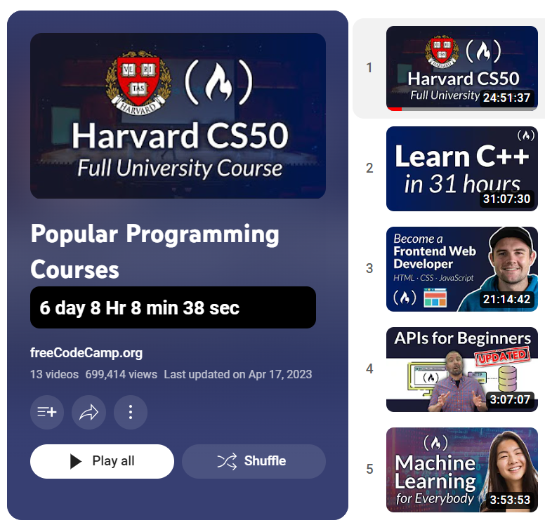

# **Youtube Playlist Time Tracker**

*Introducing Open Source **"Youtube Playlist Time Tracker"** - Uncover the **Length** of Your Favorite YouTube Playlists!*

Have you ever wondered how much time you've spent watching your beloved YouTube playlists? Say goodbye to the guessing game with "Playlist Time Tracker" Chrome extension! Gain instant insights into the **total length of any YouTube playlist in seconds**

Before using            |  After using
:-------------------------:|:-------------------------:
 |  

With **"Youtube Playlist Time Tracker,"** you can effortlessly measure the **duration of any playlist in `days`, `hours`, `minutes`, and `seconds`.** Whether it's a collection of captivating TED Talks, a binge-worthy TV show playlist, or an educational course, this extension unveils the precise time investment required.

## **Setup Locally**
To locally set up the **"Youtube Playlist Time Tracker"** Chrome extension, follow these instructions:

1. Clone the Repository:
   - Start by cloning the repository containing the extension code to your local machine.
   - You can use Git command line or a Git client of your choice to clone the repository.

2. Open Chrome Extensions:
   - Open Google Chrome browser and navigate to `chrome://extensions`.
   - Enable the "Developer mode" option located in the top right corner of the page.

        

3. Load the Extension:
   - Click on the "Load unpacked" button that appears after enabling developer mode.
   
   - Select the folder where you cloned the extension repository and click "Select" to load the extension.

4. Verify the Extension:
   - The "Playlist Time Tracker" extension should now appear in the list of installed extensions.
   - Ensure that the extension is enabled by toggling the switch if necessary.

5. Test the Extension:
   - Visit any YouTube playlist page in Chrome.(else checkout [this](https://www.youtube.com/playlist?list=PLWKjhJtqVAblfum5WiQblKPwIbqYXkDoC))

        

Congratulations! You have successfully set up the **"YouTube Playlist Time Tracker"** Chrome extension locally. Now you can use it to track the lengths of your favorite YouTube playlists right from your browser.

## **Contribute Project**

Contributing to the "Playlist Time Tracker" Chrome extension is highly appreciated! To ensure a smooth collaboration process, please follow these contribution guidelines:

1. Fork the Repository:
   - Start by forking the repository to your GitHub account.
   - This will create a copy of the repository under your account, allowing you to make changes.

2. Set up the Development Environment:
   - Clone the forked repository to your local machine.
   - Familiarize yourself with the code structure and development workflow.

3. Create a Branch:
   - Before making any changes, create a new branch for your feature or bug fix.
   - Choose a descriptive name for the branch that reflects the purpose of your contribution.

4. Make Changes:
   - Implement your desired feature or bug fix in the codebase.
   - Follow the coding style and guidelines established by the project.
   - Include clear and concise comments in your code for better understanding.

5. Test Your Changes:
   - Ensure that your modifications do not introduce any new bugs.
   - Test the extension's functionality in different scenarios to verify its correctness.
   - If applicable, update or create new tests to maintain code quality.

6. Commit and Push:
   - Commit your changes with a meaningful commit message explaining the purpose of the commit.
   - Push your branch to your forked repository on GitHub.

7. Submit a Pull Request:
   - Go to the original repository on GitHub.
   - Click on the "New Pull Request" button to create a new pull request.
   - Provide a clear and descriptive title and description for your pull request.
   - Include any relevant information or context about your changes.

8. Engage in Discussion:
   - Be responsive to any feedback or questions provided by the project maintainers.
   - Address any requested changes or updates promptly.
   - Participate in the discussion and contribute constructively to improve the codebase.

Thank you for considering contributing to the **"Youtube Playlist Time Tracker"** Chrome extension! Your contributions play a vital role in enhancing the functionality and usability of the extension.